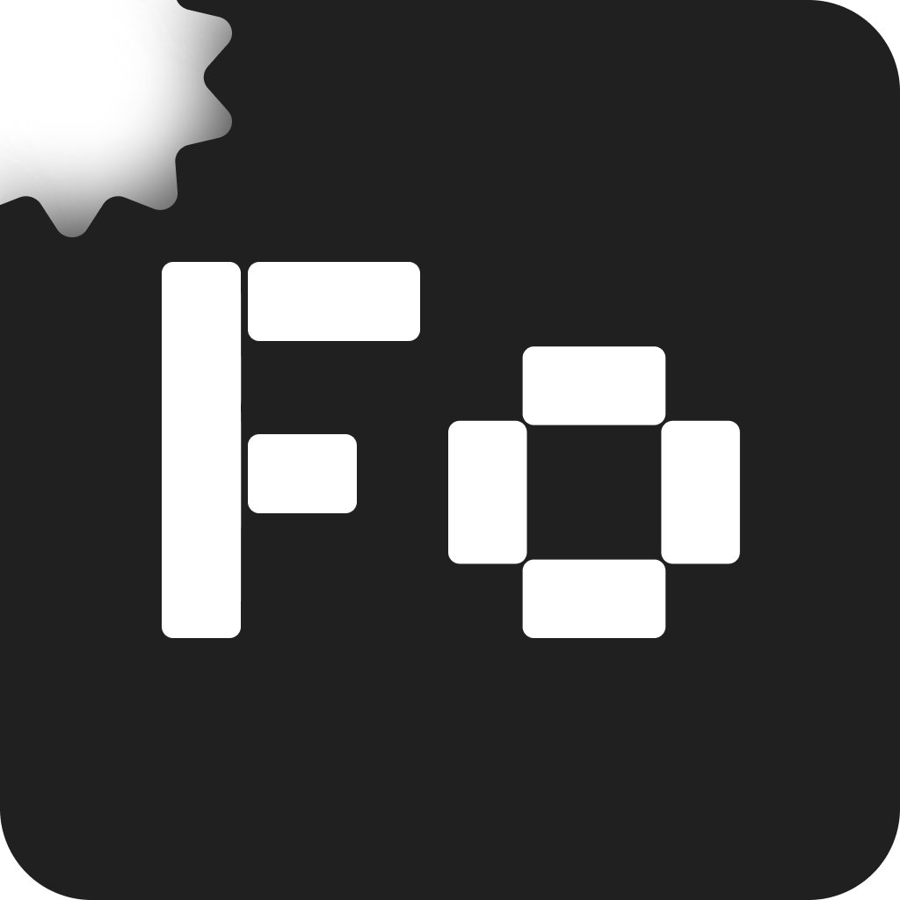

<div align="center">
  
  
  # FOCSQ

  <p><strong>Десктопный клиент многопоточного QUIC/TURN-туннеля</strong><br>
  <sub>Форк <a href="https://github.com/amurcanov/csqtt">csqtt</a> для ПК</sub></p>

  <p>
    
    
    
    
    
    
  </p>
</div>

## Установка и запуск

### Windows (10 / 11)
1. Скачайте архив или инсталлятор из раздела **Releases**:
   * **`FOCSQ-Setup.exe`** — установщик с интеграцией в систему и настройкой автозапуска.
   * **`focsq-windows-x64.zip`** — портативная версия.
2. Запустите программу от имени Администратора (требуется для управления виртуальным адаптером Wintun).

### Linux (Ubuntu, Debian, Fedora, Arch и др.)
1. Скачайте архив **`focsq-linux-x64.tar.gz`** из раздела **Releases**.
2. Распакуйте архив в любую директорию.
3. Запустите стартовый скрипт:
   ```bash
   ./focsq.sh
   ```
   *Скрипт `focsq.sh` проверяет наличие необходимых системных библиотек, выдает право `cap_net_admin` на обёртку `focsq-tun` и при первом запуске добавляет пункт меню в список приложений.*

---

## Сборка из исходников

### Системные требования
* **Flutter SDK:** >= 3.44.x (Dart >= 3.12.x)
* **Rust:** >= 1.97.x
* **Git**

### 1. Подготовка
```bash
git clone https://github.com/luminescq/focsq.git
cd focsq/frontend
```

### 2. Сборка на Windows

* **Зависимости:** Visual Studio 2022 (с компонентом «Разработка классических приложений на C++»).

```cmd
flutter pub get
flutter build windows --release
```
Исполняемый файл и зависимости будут собраны в: `frontend/build/windows/x64/runner/Release/`

### 3. Сборка на Linux

* **Установка сборочных пакетов:**
  * **Ubuntu / Debian / Linux Mint:**
    ```bash
    sudo apt update
    sudo apt install -y clang cmake ninja-build pkg-config \
      libgtk-3-dev liblzma-dev libsecret-1-dev libwebkit2gtk-4.1-dev libayatana-appindicator3-dev
    ```
  * **Arch Linux / Manjaro:**
    ```bash
    sudo pacman -S --needed clang cmake ninja pkgconf \
      gtk3 libsecret webkit2gtk-4.1 libayatana-appindicator
    ```
  * **Fedora:**
    ```bash
    sudo dnf install -y clang cmake ninja-build pkgconfig \
      gtk3-devel libsecret-devel webkit2gtk4.1-devel libayatana-appindicator-gtk3-devel
    ```

* **Компиляция:**
  ```bash
  flutter pub get
  flutter build linux --release
  ```

Готовый бандл приложения будет собран в: `frontend/build/linux/x64/release/bundle/`

---

## Структура репозитория

```text
focsq/
├── backend/                  # Ядро csqtt-core на Rust (протокол, воркеры, TUN)
│   ├── tun_win.rs            # Драйвер Wintun, IP Helper API, NRPT (Windows)
│   ├── tun_linux.rs          # Драйвер Linux TUN, Netlink, systemd-resolved
│   ├── dispatcher.rs         # Планировщик и диспетчер пакетов
│   └── turn.rs               # Реализация TURN-сессий и обфускации
├── frontend/                 # Графический интерфейс на Flutter
│   ├── assets/               # Шрифты, иконки и статические ресурсы
│   ├── lib/                  # Код приложения (экраны, сервисы, тема)
│   ├── linux/                # Платформа Linux и лаунчер focsq.sh
│   ├── rust/                 # Мост flutter_rust_bridge
│   └── windows/              # Платформа Windows
└── README.md
```

## Авторские права и лицензия

Исходный код проекта распространяется на условиях лицензии **PolyForm Noncommercial 1.0.0**:
* **Ядро сетевого протокола (`csqtt-core`):** © 2026 amurcanov
* **Клиентская часть и архитектура приложения:** © 2026 luminescq

### Ограничения на использование дизайна и брендинга (All Rights Reserved)
Все права на визуальный дизайн интерфейса (UI/UX), графические ассеты, иконки, макеты экранов, цветовую схему, название и логотип **FOCSQ** принадлежат **luminescq** (*Все права защищены*).

Действие открытой некоммерческой лицензии **не распространяется** на дизайн и элементы брендинга:
* **Запрещается** полное или частичное копирование, заимствование, распространение или повторное использование визуального дизайна и компонентов интерфейса в любых сторонних приложениях, форках или проектах.
* **Запрещается** использование товарного знака, названия «FOCSQ», фирменного стиля и оригинальных логотипов без предварительного письменного разрешения автора.
* При создании форков или модификаций кодовой базы вы обязаны разработать собственный независимый графический интерфейс и использовать другое название и логотип.
